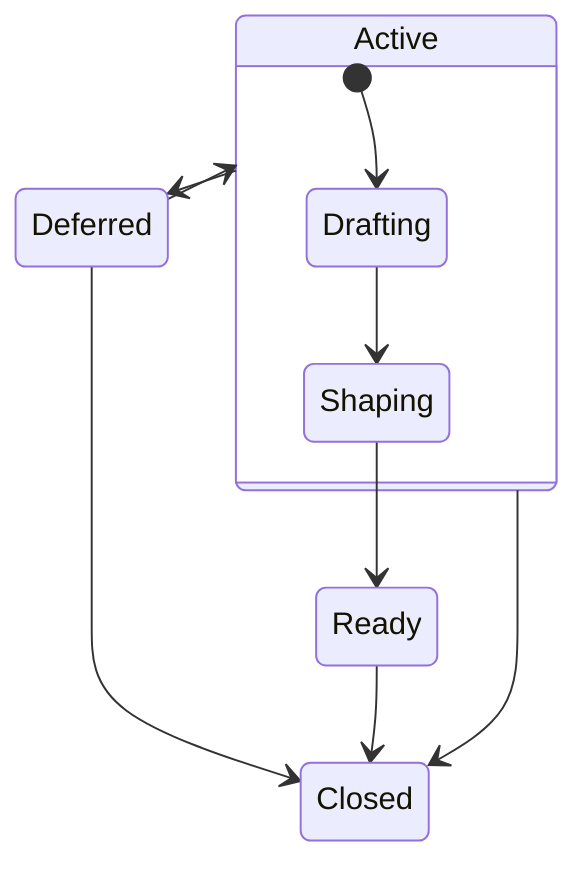
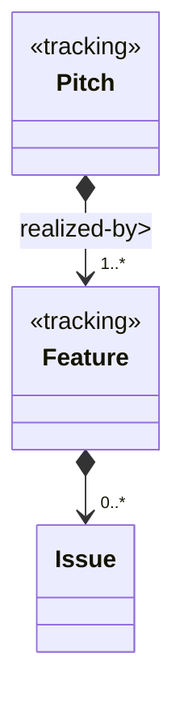
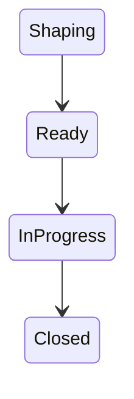

# Issue Life-Cycle

## Pitch Issues
'Pitch' issues are created to support _planned_ work, and capture suggestions for new features and/or improvements. 'Pitch' issues are captured on the [Pitches GitHub Project](https://github.com/orgs/p4lang/projects/1/views/1) and guided by the following states:

|State|Description|
|-----|-----------|
| Active | A composite state (not physically represented or directly selectable), that means a pitch is being actively worked on.  |
| Drafting /Active | The pitch is being proposed with _coarse_ level detail. |
| Shaping /Active | The pitch is being shaped.  |
| Ready | Enough detail has been presented via the pitch and associated 'feature' issues that work can now be scheduled and started.  |
| Deferred | The pitch has been deprioritized or will not be actively worked on in the near term.  |
| Closed | The pitch has been closed. The labels associated with the pitch issue may provide more context.  |

### Shaping Pitch Issues
In the `'Drafting'` phase, the idea for a feature or a suggestion will likely not have the fidelity that is required for work to be planned or implemented against. A draft pitch may only contain a few lines of detail when it is being created. In its early existence, a pitch will need to provide enough information to convince the P4 Analyzer Team, and the supporting community, in supporting its development. Once this is done, a pitch firmly enters its `'Shaping'` phase where the focus now changes to how this _proposal_ can be delivered.

It is recommended that at least one 'Feature' issue be created and assocaited with the 'Pitch' issue to capture this _refinement_.

> **ℹ Note**  
Keeping the 'Pitch' and 'Feature' issues separate allows for technical, design, and implementation conversations to be captured on the feature, and broader discussions to continue on the pitch.

## 'Feature' Issues

The following diagram describes the relationship between a Pitch and a Feature:

Ultimately, a pitch is fully realized through one or more features. Features may also be further segmented into other _smaller_ pieces of work if a feature is epic-like. When this happens, the 'Feature' issue (like a 'Pitch' issue) becomes a tracking issue and the segmented work is created as additional issues and associated with the 'Feature' issue.

The aim is not to be too regimented since this is an open source project working with contributors outside of the core P4 Analyzer Team. The core team, however, will aim to follow these principles in order to be more accountable for their time.

Features  are captured and tracked on the [Features GitHub Project](https://github.com/orgs/p4lang/projects/2/views/1) and guided by the following states:

|State|Description|
|-----|-----------|
| Shaping | The feature is being designed as part of its associated 'Pitch' shaping. |
| Ready | The issue has all the elaborated information required for implementation in code.  |
| InDevelopment | Development work is currently in progress. Expect a PR shortly. |
| Closed | The feature has been closed. The labels associated with the feature issue may provide more context. |

## Unplanned Work
Unplanned work is either a reported Bug issue, or external Pull Requests that require review by a core P4 Analyzer Team member. These issues will also be tracked on the [Features GitHub Project](https://github.com/orgs/p4lang/projects/2/views/1) and guided by the same states.
