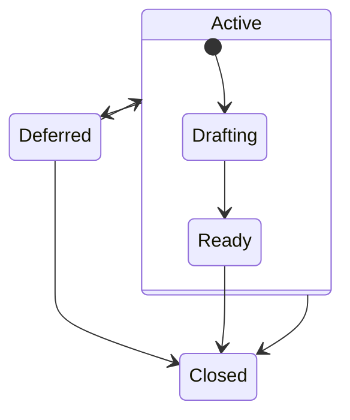
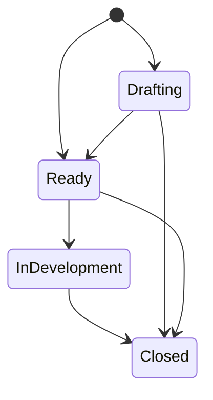

# Issue Life-Cycle
The information here is mostly relevant to the core P4 Analyzer team. However, if you are considering submitting a
proposal for a feature or an idea that you have, then the _Proposal Issues_ section will be of interest to you.

## Proposal Issues
'Proposal' issues are created to support _planned_ work, and capture suggestions for new features and/or improvements.
Proposals are captured on the [Proposal GitHub Project](https://github.com/orgs/p4lang/projects/1/views/1)
and guided by the following states:

|State|Description|
|-----|-----------|
| Active | A composite state (not physically represented or directly selectable), that means a proposal is being actively worked on.  |
| Drafting /Active | The proposal is being drafted with _coarse_ level detail. |
| Ready /Active | Enough detail has been captured and the proposed work can now be scheduled and started.  |
| Deferred | The pitch has been deprioritized and will not be actively worked on in the near term.  |
| Closed | The pitch has been closed. The labels associated with the pitch issue may provide more context.  |

When a proposal enters the `'Ready'` state, the core P4 Analyzer team will aim to assign it to a suitable milestone
thereby including it in the roadmap.

### Elaborating Proposal Issues
In the `'Drafting'` state, the idea for a feature or a suggestion will likely not have the fidelity that is required
for work to be planned or implemented against. A draft proposal may only contain a few lines of detail when it is being
created. In its early existence, a proposal will need to provide enough information to at least convince the P4
Analyzer Team, and the supporting community, in supporting its development. 

As proposals go through elaboration, the 'Proposal' Issue will be used to capture thoughts, discussions, and design
decisions that can be used to inform its implementation. If the proposal gets large, then it may be best to convert
it into a _tracking issue_ by adding the `'C-tracking'` label to it, and then breaking the detail down into other
smaller GitHub Issues which are added to it via a 'Task List' on its description.

## General Issue Management
Planned work for the core P4 Analyzer Team is captured and tracked on the private
[PlannedWork GitHub Project](https://github.com/orgs/p4lang/projects/2/views/1) and guided by the following states:

|State|Description|
|-----|-----------|
| Drafting | The issue is a `'C-proposal'` and is being elaborated on. |
| Ready | The issue is ready to be assigned to and worked on. |
| InDevelopment | Development work is currently in progress. Expect a PR shortly. |
| Closed | The issue has been closed. The labels associated with the issue may provide more context. |

The starting state for an Issue can be `'Drafting'` or `'Ready'`. Typically `'Drafting'` will be used for Proposal
Issues that are currently being elaborated, but it may also be applied to other Issues, if for example, there
isn't enough detail on an Issue for work to continue. If this is the case, then other labels may indicate what is
required for the Issue to progress.

The core P4 Analyzer team will typically manage their day to day activities through the
[PlannedWork GitHub Project](https://github.com/orgs/p4lang/projects/2/views/1).

